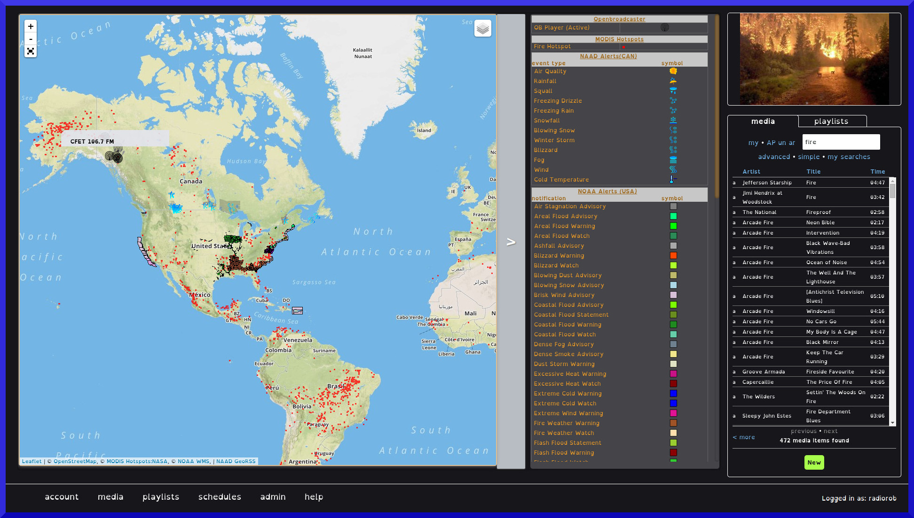
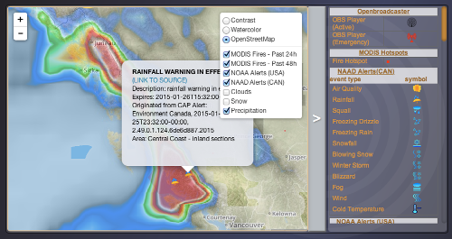

* TOC
{:toc}

## Mapping module
{:toc}

## Description

Provides an interactive map, showing NAAD and NOAA public alerts areas affected by current CAP alerts, including Canada and US, current global weather patterns[1], as well as location of OBPlayer installations managed by your OB Server instance. 

Mapping works as a standalone application and follows the OpenBroadcaster module framework to allow integration into the <a href="https://github.com/openbroadcaster/observer"> OBServer Platform</a>.

The National Alert Aggregation & Dissemination (NAAD)<a href="https://alerts.pelmorex.com/other-resource/"> GeoRSS</a> feed provides realtime Active Public Safety Messages (CAP-CP) alerts issued by Authorized Government Agencies for Canada (see <a href="https://alerts.pelmorex.com/techinfo/">tech info</a> for specs). The feed may be found at <a href="http://rss.naad-adna.pelmorex.com/">http://rss.naad-adna.pelmorex.com/</a>.  Conversion of the GeoRSS feed into geoJSON makes use of Andrew Harvey's excellent <a href="https://github.com/andrewharvey/map.rfs"> prototype</a>

The National Oceanic & Atmospheric Administration (NOAA) provides a <a href="https://idpgis.ncep.noaa.gov/arcgis/rest/services/NWS_Forecasts_Guidance_Warnings/watch_warn_adv/MapServer">WMS map service</a> shows where a warning of hazardous weather or hydrologic event is occurring, imminent or likely.

{: .Mapping}

## Install

Clone git repo for Mapping module into the webroot/modules/device_map directory: 
 "git clone https://github.com/openbroadcaster/mapping.git device_map"

You may need to change ownership of all files to be readable by the web-user:
 "chown web-user:web-user device_map/ -R"

Install required PERL modules (as root):
perl -MCPAN -e shell 'install XML::Simple XML::Twig JSON'

Change to includes drectory:
 "cd device_map/includes/"
	
Run shell script:
 './convert_emerg_feed.sh' to seed alerts file.

Edit main js/layout.js at line 188:
     following 'layout.set_main_size();'
	"ModuleDevicemap.init_map();"

Add a CRON job to run conversion script. For example, to run every 15 minutes:
 */15 * * * * cd /var/www/html/OpenBC/modules/device_map/includes && ./convert_emerg_feed.pl

Install the module from the admin/module menu in server to create a menu item.

## Components

<a href="http://jquery.com">jQuery</a> 
<a href="http://leafletjs.com">Leafletjs</a> javascript library. 
<a href="https://github.com/perliedman/leaflet-realtime">Leaflet-Realtime</a> plugin for adding map layers for live tracking of GPS, sensor data, etc.

{: .Mapping Settings}

